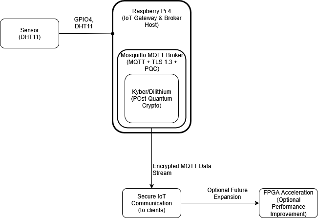

# Post-Quantum Secure IoT Gateway

## Project Description
This project demonstrates a secure IoT gateway using Post-Quantum Cryptography.
It secures communication using MQTT protocol and TLS 1.3, implemented on a RAspberry Pi

## Hardware Components

| Component           | Purpose                       | Quantity    |
|---------------------|-------------------------------|-------------|
| Raspberry Pi 4      | Main IoT Gateway controller   | 1           |
| MicroSD Card        | Raspberry Pi OS Storage       | 1 (16GB+)   |
| Power Supply        | Power Raspberry Pi            | 1 (5V, 3A)  |
| Breadboard          | Prototyping Connections       | 1           |
| Jumper wires        | Connections                   | Assorted    |
| DHT11 sensor        | Temperature & Humidity sensor | 1           |
| Ethernet cable      | Network connection            | 1 (optional Wi-Fi) |

## Optional Components (Future Implementation)

| Component           | Purpose                           |
|---------------------|-----------------------------------|
| FPGA Board          | Hardware acceleration (optional)  |

## Diagrams & Schematics

### System Block Diagram:

This diagram shows the data flow from the sensor (DHT11) through the Raspberry Pi acting as an IoT Gateway. It highlights the use of Mosquitto MQTT Broker with TLS 1.3 and post-quantum cryptography (Kyber/Dilithium) to enable secure data transmission.

### Raspberry Pi and Sensor Schematic:

The schematic details how the DHT11 sensor connects to the Raspberry Pi, including the required 10k pull-up resistor on the DATA line to 3.3V.
